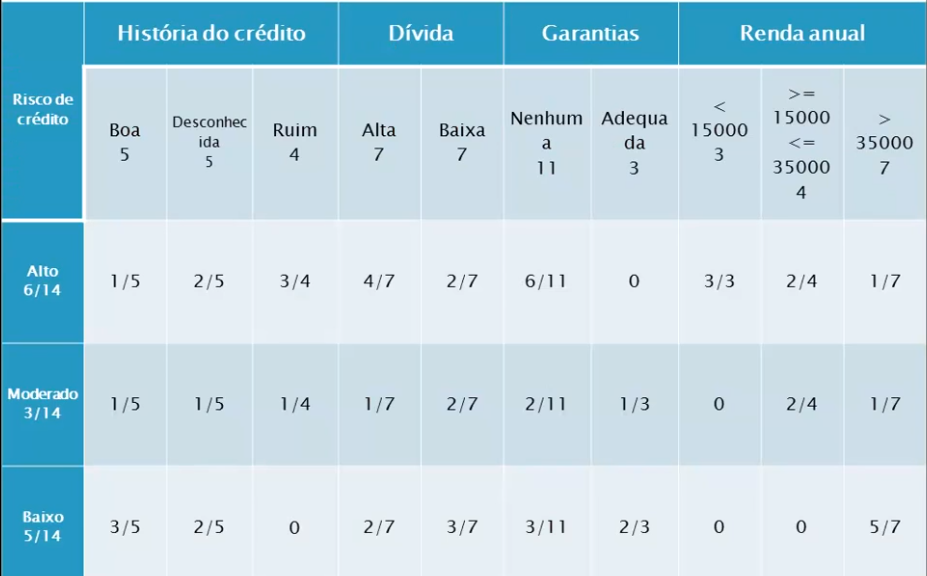
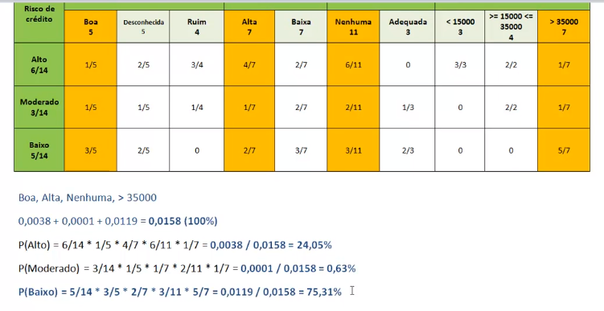
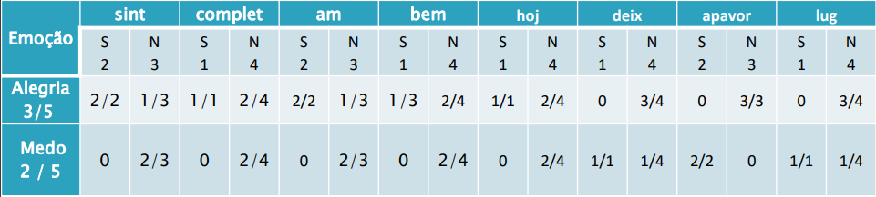
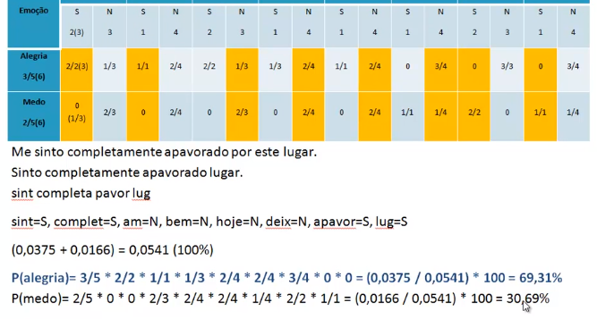

# Naive Bayes

Base de dados original

| História do Crédito | Dívida | Garantias | Renda anual           | Risco    |
| ------------------- | ------ | --------- | --------------------- | -------- |
| Ruim                | Alta   | Nenhuma   | < 15.000              | Alto     |
| Desconhecida        | Alta   | Nenhuma   | >= 15.000 a <= 35.000 | Alto     |
| Desconhecida        | Baixa  | Nenhuma   | >= 15.000 a <= 35.000 | Moderado |
| Desconhecida        | Baixa  | Nenhuma   | < 15.000              | Alto     |
| Desconhecida        | Baixa  | Nenhuma   | > 35.000              | Baixo    |
| Desconhecida        | Baixa  | Adequada  | > 35.000              | Baixo    |
| Ruim                | Baixa  | Nenhuma   | < 15.000              | Alto     |
| Ruim                | Baixa  | Adequada  | > 35.000              | Moderado |
| Boa                 | Baixa  | Nenhuma   | > 35.000              | Baixo    |
| Boa                 | Alta   | Adequada  | > 35.000              | Baixo    |
| Boa                 | Alta   | Nenhuma   | < 15.000              | Alto     |
| Boa                 | Alta   | Nenhuma   | >= 15.000 a <= 35.000 | Moderado |
| Boa                 | Alta   | Nenhuma   | > 35.0000             | Baixo    |
| Ruim                | Alta   | Nenhuma   | >= 15.000 a <= 35.000 | Alto     |

Com a base de dados acima e através da **aprendizagem (treinamento)** é montado uma tabela de probabilidades

Para preencher a tabela acima, basta seguir o passo a passo abaixo:

1. Na coluna **Risco de crédito** são dispostas todas as classes e com uma descrição de `quantidade de registros da classe / total de registros (14)`
2. As próximas colunas são agrupadas pelos **atributos previsores**, cada um contendo suas possibilidades.

Para **Histórico do crédito** (**Boa** com 5 registros, **Desconhecida** com 5 registros e **Ruim** com 4 registros), e o próximo passo é fazer a **intersecção** com o risco de crédito, verificando por exemplo, quantos registros com história de crédito **Boa** possuem risco **Alto**.

E assim por diante para todas as colunas.

## Exemplo de cálculo por inferência para novos registros

Para um novo cliente com história de crédito **Boa**, dívida **Alta**, garantias **Nenhuma** e renda anual **> 35.000**.

Utilizando a fórmula `P (Risco) = RISCO * HISTORIA_CREDITO * DIVIDA * GARANTIA * RENDA ANUAL` calcula-se a probabilidade para todas as classes, a que tiver maior valor será a classificada.

## Naive Bayes em Textos

Com as frases originais e suas versões pré processadas, conseguimos aplicar o algoritmo de naive bayes.

| Frase original               | Frase pré-processada | Classe  |
| ---------------------------- | -------------------- | ------- |
| Me sinto completamente amado | sint complet am      | Alegria |
| Eu estou muito bem hoje      | bem hoj              | Alegria |
| Eu sinto amor por você       | sint am              | Alegria |
| Isso me deixa apavorada      | deix apavor          | Medo    |
| Este lugar é apavorante      | lug apavor           | Medo    |

Extraímos as características

| sint | complet | am  | bem | hoj | deix | apavor | lug | Classe  |
| ---- | ------- | --- | --- | --- | ---- | ------ | --- | ------- |
| S    | S       | S   | N   | N   | N    | N      | N   | Alegria |
| N    | N       | N   | S   | S   | N    | N      | N   | Alegria |
| S    | N       | S   | N   | N   | N    | N      | N   | Alegria |
| N    | N       | N   | N   | N   | S    | S      | N   | Medo    |
| N    | N       | N   | N   | N   | N    | S      | S   | Medo    |

E a tabela probabilistica fica:

## Exemplo de cálculo por inferência para novos registros de textos

